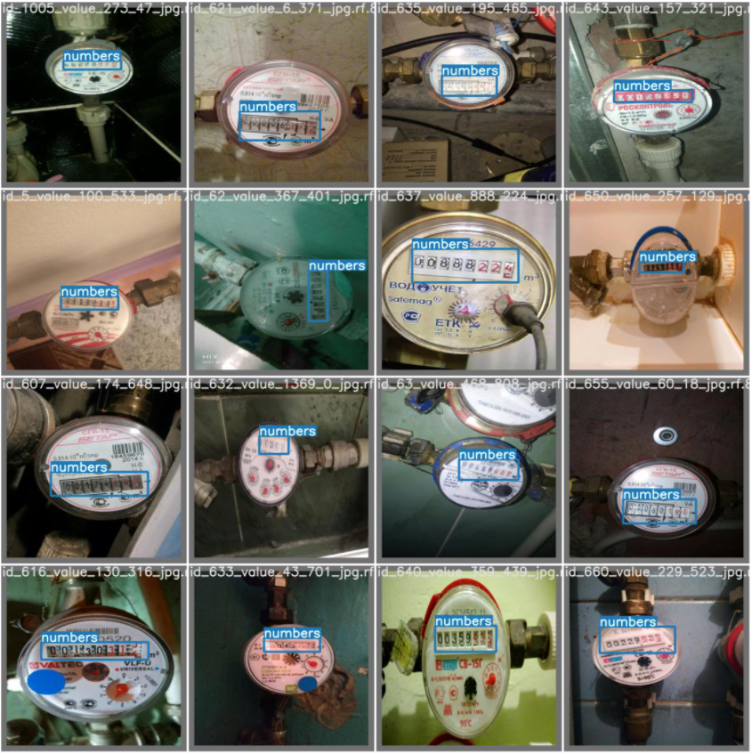

# Water Meter Detection

[![Contributors][contributors-shield]][contributors-url]
[![Forks][forks-shield]][forks-url]
[![Stargazers][stars-shield]][stars-url]
[![Issues][issues-shield]][issues-url]
[![MIT License][license-shield]][license-url]
<!-- [![LinkedIn][linkedin-shield]][linkedin-url] -->


<!-- PROJECT LOGO -->
<br />
<p align="center">
  <a href="https://github.com/daca1897/Yolo-Water-Meters/tree/main/Water%20Meter%20Detection">
    
  </a>

  <h3 align="center"> Water Meter Detection </h3>

  <p align="center">
    Detection of the number box of a water meter of a boat.
    <br />
    <a href="docs"><strong>Explore the docs »</strong></a>
    <br />
    <br />
  </p>
</p>


<!-- TABLE OF CONTENTS -->
<details open="open">
  <summary><h2 style="display: inline-block">Table of Contents</h2></summary>
  <ol>
    <li>
      <a href="#about-the-project">About The Project</a>
      <ul>
        <li><a href="#built-with">Built With</a></li>
      </ul>
    </li>
    <li>
      <a href="#getting-started">Getting Started</a>
      <ul>
        <li><a href="#prerequisites">Prerequisites</a></li>
        <li><a href="#installation">Installation</a></li>
      </ul>
    </li>
    <li><a href="#usage">Usage</a></li>
    <li><a href="#roadmap">Roadmap</a></li>
    <li><a href="#contributing">Contributing</a></li>
    <li><a href="#license">License</a></li>
    <li><a href="#contact">Contact</a></li>
    <li><a href="#acknowledgements">Acknowledgements</a></li>
  </ol>
</details>

<!-- ABOUT THE PROJECT -->
## About The Project
YoloV5 implemented by Pytorch , with support for training, evaluation and inference in a custom data set.


### Built With
* [pytorch](https://pytorch.org/)
* [networkx](https://networkx.org/)
* [matplotlib](https://matplotlib.org/)
* [opencv](https://opencv.org/)
* [YoloV5] (https://github.com/ultralytics/yolov5)

<!-- GETTING STARTED -->
## Getting Started
To get a local copy just executed the following command:
Activate environment
```sh
git clone https://github.com/daca1897/Yolo-Water-Meters.git
```

### Prerequisites
Install all the requerements:
```sh
pip3 -m install -U -r requirements.txt
```

<!-- USAGE EXAMPLES -->
## Usage
The project was developed in three parts:
1. Preprocessing of images and data augmentation 
2. Modeling of the YoloV5 and implementation using water meter images 
3. Training of the network
4. Obtaining the water meter recognition of the testing images

The development of all the steps are consigned in the **main notebook**.


<!-- CONTRIBUTING -->
## Contributing

Contributions are what make the open source community such an amazing place to be learn, inspire, and create. Any contributions you make are **greatly appreciated**.

1. Fork the Project
2. Create your Feature Branch (`git checkout -b feature/AmazingFeature`)
3. Commit your Changes (`git commit -m 'Add some AmazingFeature'`)
4. Push to the Branch (`git push origin feature/AmazingFeature`)
5. Open a Pull Request

<!-- LICENSE -->
## License

Distributed under the MIT License. See `LICENSE` for more information.


<!-- CONTACT -->
## Contact

* Diego Carreño (diego-andres.carreno-avila@imt-atlantique.net) - [![Linkend][linkedin-shield]][linkedin-url-3]
* Project Link: [https://github.com/daca1897/Yolo-Water-Meters/tree/main/Water%20Meter%20Detection]


<!-- ACKNOWLEDGEMENTS -->
## Acknowledgements
* [Best-README-Template](https://github.com/othneildrew/Best-README-Template) for providing the README template.

<!-- MARKDOWN LINKS & IMAGES -->
<!-- https://www.markdownguide.org/basic-syntax/#reference-style-links -->
[contributors-shield]: https://img.shields.io/github/contributors/Johansmm/zombies-spread-dynamics.svg?style=for-the-badge
[contributors-url]: https://github.com/Johansmm/zombies-spread-dynamics/network/contributors
[forks-shield]: https://img.shields.io/github/forks/Johansmm/zombies-spread-dynamics.svg?style=for-the-badge
[forks-url]: https://github.com/Johansmm/zombies-spread-dynamics/network/members
[stars-shield]: https://img.shields.io/github/stars/Johansmm/zombies-spread-dynamics.svg?style=for-the-badge
[stars-url]: https://github.com/Johansmm/zombies-spread-dynamics/stargazers
[issues-shield]: https://img.shields.io/github/issues/Johansmm/zombies-spread-dynamics.svg?style=for-the-badge
[issues-url]: https://github.com/Johansmm/zombies-spread-dynamics/issues
[license-shield]: https://img.shields.io/github/license/Johansmm/zombies-spread-dynamics.svg?style=for-the-badge
[license-url]: https://github.com/Johansmm/zombies-spread-dynamics/blob/master/LICENSE.txt
[linkedin-shield]: https://img.shields.io/badge/-LinkedIn-black.svg?style=for-the-badge&logo=linkedin&colorB=555

[linkedin-url-1]: https://www.linkedin.com/in/johansmm/
[linkedin-url-2]: https://www.linkedin.com/in/tatiana-moreno-perea/
[linkedin-url-3]: https://www.linkedin.com/in/diego-andres-carre%C3%B1o-49b2ab157/
